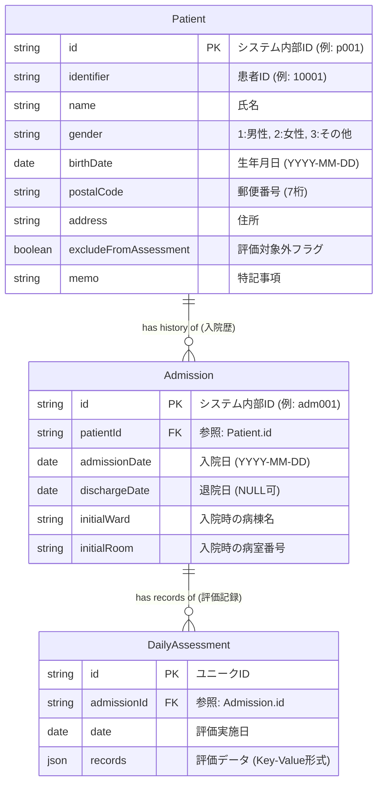

# HfileMaker データスキーマ定義

本ドキュメントでは、HfileMakerアプリケーションで使用されるデータ構造について記述します。
システムは正規化されたリレーショナルモデルを採用しており、現在はブラウザの `LocalStorage` を使用して実装されています。

## ER図 (Entity-Relationship Diagram)

## テーブル定義

### 1. Patient (患者マスタ)
患者の個人情報を管理します。頻繁に変更されることのない属性情報です。

| フィールド名 | 型 | 説明 |
|---|---|---|
| `id` | string (PK) | システム内部で一意に識別するためのID。ランダム生成されます。 |
| `identifier` | string | 画面に表示される医療機関ごとの患者ID (カルテ番号)。 |
| `name` | string | 患者の氏名。 |
| `gender` | enum | 性別コード。 '1' (男性), '2' (女性), '3' (その他)。 |
| `birthDate` | string | 生年月日。 YYYY-MM-DD 形式。 |
| `postalCode` | string | 郵便番号 (7桁)。住所検索に使用されます。 |
| `address` | string | 住所。検索結果または手入力により設定されます。 |
| `excludeFromAssessment` | boolean | trueの場合、看護必要度の集計対象から除外されます。 |
| `memo` | string | 申し送り事項や注意点などの自由記述メモ。 |

### 2. Admission (入院履歴)
患者の「入院」というイベントを管理します。1人の患者に対して、過去の入院も含めて複数のレコードが存在し得ます。

| フィールド名 | 型 | 説明 |
|---|---|---|
| `id` | string (PK) | システム内部ID。 |
| `patientId` | string (FK) | `Patient` テーブルの `id` への外部キー参照。 |
| `admissionDate` | string | 入院年月日 (YYYY-MM-DD)。 |
| `dischargeDate` | string? | 退院年月日。 `null` または `undefined` の場合は「現在入院中」を意味します。 |
| `initialWard` | string | 入院時点での病棟名 (例: "一般病棟")。 |
| `initialRoom` | string | 入院時点での病室番号。 |

### 3. DailyAssessment (日次評価)
特定の日付における看護必要度の評価記録を管理します。

| フィールド名 | 型 | 説明 |
|---|---|---|
| `admissionId` | string (FK) | `Admission` テーブルの `id` への外部キー参照。 |
| `date` | string | 評価対象日 (YYYY-MM-DD)。 |
| `records` | object | 評価項目のデータを Key-Value 形式で保持するJSONオブジェクト。 |
| `records[itemId]` | any | 各項目の評価値 (チェックボックスならboolean、選択肢なら数値/文字列)。 |

## 今後の拡張設計案 (Future Roadmap)

システムの堅牢性と拡張性を高めるため、将来的には以下のテーブル導入が推奨されます。

### 1. 病棟・病室マスタ (Ward/Room Master)
現在は "一般病棟" や "101" という文字列を直接保存していますが、マスタテーブルを作成して管理すべきです。
*   **Ward (病棟)**: `id`, `name`, `type` (病棟種別)
*   **Room (病室)**: `id`, `wardId`, `roomNumber`, `bedCount` (ベッド数)

### 2. 転棟履歴 (Transfer History)
現在は `Admission` テーブルに `initialWard` (入院時の病棟) しか持っていません。入院中に病棟移動（例：一般病棟 → ICU）があった場合を記録するため、履歴テーブルが必要です。
*   **Transfer**: `id`, `admissionId`, `fromWardId`, `toWardId`, `transferDate`

### 3. ユーザー管理 (User/Nurse Management)
「誰が」評価を行ったかを記録するために必要です。
*   **User**: `id`, `name`, `role` (権限), `passwordHash`
*   `DailyAssessment` テーブルに `created_by`, `updated_by` フィールドを追加して記録します。
