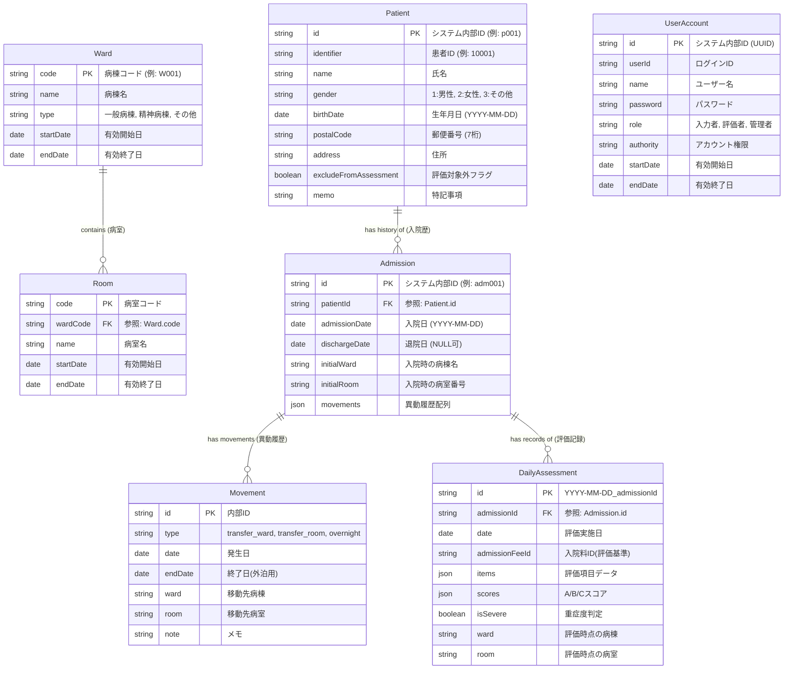

# HfileMaker データスキーマ定義

本ドキュメントでは、HfileMakerアプリケーションで使用されるデータ構造について記述します。
システムは正規化されたリレーショナルモデルを採用しており、現在はブラウザの `LocalStorage` を使用して実装されています。

## ER図 (Entity-Relationship Diagram)

## テーブル定義

### 1. Patient (患者マスタ)
患者の個人情報を管理します。頻繁に変更されることのない属性情報です。

| フィールド名 | 型 | 説明 |
|---|---|---|
| `id` | string (PK) | システム内部で一意に識別するためのID。ランダム生成されます。 |
| `identifier` | string | 画面に表示される医療機関ごとの患者ID (カルテ番号)。 |
| `name` | string | 患者の氏名。 |
| `gender` | enum | 性別コード。 '1' (男性), '2' (女性), '3' (その他)。 |
| `birthDate` | string | 生年月日。 YYYY-MM-DD 形式。 |
| `postalCode` | string | 郵便番号 (7桁)。住所検索に使用されます。 |
| `address` | string | 住所。検索結果または手入力により設定されます。 |
| `excludeFromAssessment` | boolean | trueの場合、看護必要度の集計対象から除外されます。 |
| `memo` | string | 申し送り事項や注意点などの自由記述メモ。 |

---

### 2. Ward (病棟マスタ)
病棟のマスタデータを管理します。

| フィールド名 | 型 | 説明 |
|---|---|---|
| `code` | string (PK) | 病棟コード (例: W001) |
| `name` | string | 病棟名 (例: 一般病棟A) |
| `type` | enum | '一般病棟', '精神病棟', 'その他' |
| `startDate` | string? | 有効開始日 (YYYY-MM-DD) |
| `endDate` | string? | 有効終了日 (YYYY-MM-DD) |

---

### 3. Room (病室マスタ)
病室のマスタデータを管理します。**必ず特定の病棟に紐づきます。**

| フィールド名 | 型 | 説明 |
|---|---|---|
| `code` | string (PK) | 病室コード |
| `wardCode` | string (FK) | 所属する病棟のコード。Ward.codeへの外部キー参照。 |
| `name` | string | 病室名 (例: 101, 東102) |
| `startDate` | string? | 有効開始日 |
| `endDate` | string? | 有効終了日 |

---

### 4. UserAccount (ユーザーアカウントマスタ)
システム利用者を管理します。

| フィールド名 | 型 | 説明 |
|---|---|---|
| `id` | string (PK) | システム内部UUID |
| `userId` | string | ログインID |
| `name` | string | ユーザー名 |
| `password` | string | パスワード |
| `role` | enum | '入力者', '評価者', '管理者' |
| `authority` | enum | '一般アカウント', '施設管理者アカウント', 'システム管理者アカウント' |
| `startDate` | string? | 有効開始日 |
| `endDate` | string? | 有効終了日 |

---

### 5. Admission (入院履歴)
患者の「入院」というイベントを管理します。1人の患者に対して、過去の入院も含めて複数のレコードが存在し得ます。
**異動履歴（転棟・転床・外泊）は `movements` 配列として保持します。**

| フィールド名 | 型 | 説明 |
|---|---|---|
| `id` | string (PK) | システム内部ID。 |
| `patientId` | string (FK) | `Patient` テーブルの `id` への外部キー参照。 |
| `admissionDate` | string | 入院年月日 (YYYY-MM-DD)。 |
| `dischargeDate` | string? | 退院年月日。 `null` の場合は「現在入院中」。 |
| `initialWard` | string | 入院時点での病棟名。 |
| `initialRoom` | string | 入院時点での病室番号。 |
| `movements` | Movement[] | 入院期間中の異動履歴配列。 |

---

### 6. Movement (異動履歴)
入院期間中の転棟・転床・外泊を記録します。`Admission.movements` 配列内に格納されます。

| フィールド名 | 型 | 説明 |
|---|---|---|
| `id` | string (PK) | 内部ID |
| `type` | enum | 'transfer_ward' (転棟), 'transfer_room' (転床), 'overnight' (外泊) |
| `date` | string | 発生日 (転棟・転床日または外泊開始日) |
| `endDate` | string? | 外泊終了日 (外泊のみ使用) |
| `ward` | string? | 移動先の病棟名 |
| `room` | string? | 移動先の病室番号 |
| `note` | string? | メモ |

---

### 7. DailyAssessment (日次評価)
特定の日付における看護必要度の評価記録を管理します。
**入院履歴 (Admission) に紐づきます。**

| フィールド名 | 型 | 説明 |
|---|---|---|
| `id` | string (PK) | 一意のID (形式: `YYYY-MM-DD_admissionId`) |
| `admissionId` | string (FK) | `Admission` テーブルの `id` への外部キー参照。 |
| `date` | string | 評価対象日 (YYYY-MM-DD)。 |
| `admissionFeeId` | string | 選択された入院料ID (評価基準を決定) |
| `items` | object | 評価項目のデータを Key-Value 形式で保持。 |
| `scores` | object | 自動計算されたスコア `{ a: number, b: number, c: number }` |
| `isSevere` | boolean | 重症度基準を満たすかどうかの判定結果 |
| `ward` | string? | 評価時点の病棟 |
| `room` | string? | 評価時点の病室 |

---

## LocalStorage キー一覧

| キー | 内容 |
|---|---|
| `hfile_patients` | 患者マスタ配列 |
| `hfile_admissions` | 入院履歴配列 |
| `hfile_wards` | 病棟マスタ配列 |
| `hfile_rooms` | 病室マスタ配列 |
| `hfile_users` | ユーザーアカウント配列 |
| `hfile_assessment_{admissionId}_{date}` | 日次評価データ (個別) |
