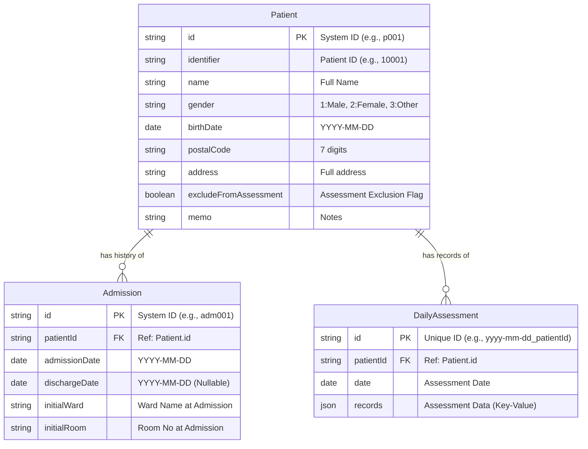

# HfileMaker Data Schema

This document outlines the data structure used in the HfileMaker application. The system uses a normalized relational model, currently implemented using browser `LocalStorage`.

## ER Diagram (Entity-Relationship)

## Table Definitions

### 1. Patient (Master)
Represents the core identity of a patient. This data changes infrequently.

| Field | Type | Description |
|---|---|---|
| `id` | string (PK) | Internal system identifier. Randomly generated. |
| `identifier` | string | Medical Record Number (Patient ID) displayed in UI. |
| `name` | string | Patient's full name. |
| `gender` | enum | '1' (Male), '2' (Female), '3' (Other). |
| `birthDate` | string | Format: YYYY-MM-DD. |
| `postalCode` | string | 7-digit postal code (used for address search). |
| `address` | string | Full address derived from postal code or manually entered. |
| `excludeFromAssessment` | boolean | If true, excluded from nursing necessity statistics. |
| `memo` | string | Free text for medical notes or precautions. |

### 2. Admission (Transaction)
 Represents a period of hospitalization. One patient can have multiple admission records over time.

| Field | Type | Description |
|---|---|---|
| `id` | string (PK) | Internal system identifier. |
| `patientId` | string (FK) | Reference to `Patient.id`. |
| `admissionDate` | string | Date of admission (YYYY-MM-DD). |
| `dischargeDate` | string? | Date of discharge. `null` or `undefined` implies currently hospitalized. |
| `initialWard` | string | Ward name at the time of admission (e.g., "一般病棟"). |
| `initialRoom` | string | Room number at the time of admission. |

### 3. DailyAssessment (Transaction)
Represents the nursing necessity assessment record for a specific day.

| Field | Type | Description |
|---|---|---|
| `patientId` | string (FK) | Reference to `Patient.id`. |
| `date` | string | Date of assessment (YYYY-MM-DD). |
| `records` | object | Key-value pairs of assessment items. |
| `records[itemId]` | any | Value of the assessment (boolean for Checkbox, number/string for Select). |

## Future Design Considerations (To Be Implemented)

To make the system more robust and scalable, the following tables should be introduced in a future update:

### 1. Ward/Room Master
Instead of hardcoding "一般病棟" or "101", use master tables.
*   **Ward**: `id`, `name`, `type`
*   **Room**: `id`, `wardId`, `roomNumber`, `bedCount`

### 2. Transfer History
Currently, only `initialWard` is recorded. To track transfers (e.g., General Ward -> ICU), a new table is needed.
*   **Transfer**: `id`, `admissionId`, `fromWardId`, `toWardId`, `transferDate`

### 3. User (Nurse) Management
To record *who* performed the assessment.
*   **User**: `id`, `name`, `role`, `passwordHash`
*   Add `created_by` and `updated_by` fields to `DailyAssessment`.
